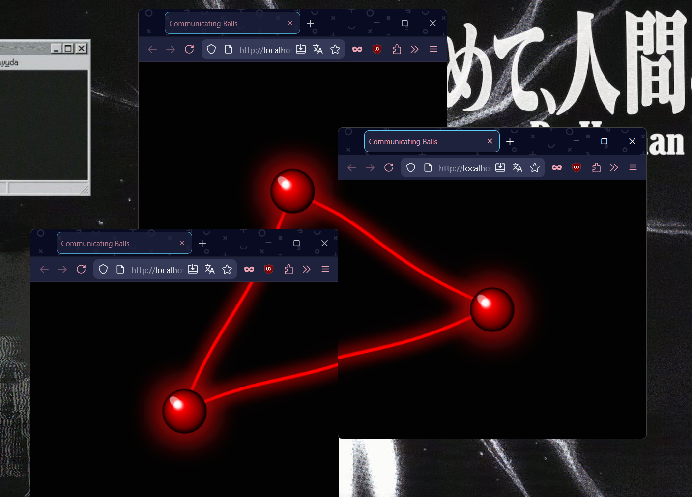
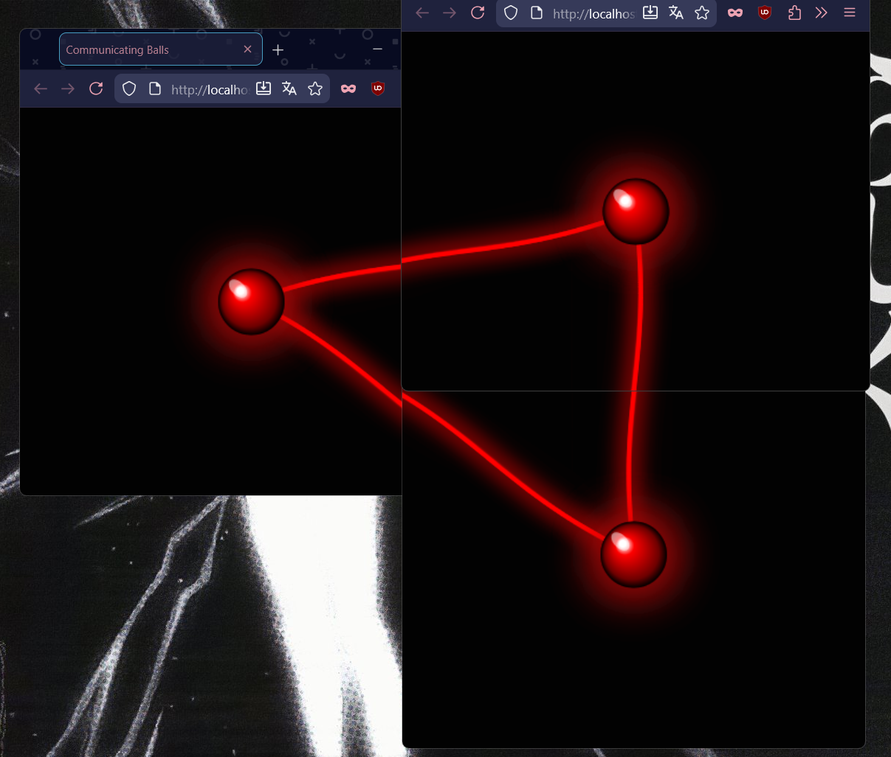

# Communicating Balls 🔴

Birden fazla tarayıcı penceresi arasında gerçek zamanlı iletişim kuran interaktif top animasyonu.

## 🚀 Özellikler

- Birden fazla tarayıcı penceresi arasında **BroadcastChannel API** ile senkronizasyon
- Her pencerede animasyonlu 3D toplar
- Pencereler arasında bağlantı çizgileri
- Gerçek zamanlı pozisyon paylaşımı

## 📦 Kurulum

```bash
npm install
```

## ▶️ Çalıştırma

```bash
npm start
```

(Bu komut otomatik olarak 3 Firefox penceresi açar ve uygulamayı başlatır.)

## 🛠️ Teknolojiler

- **Express.js** - Web sunucusu
- **EJS** - View template engine
- **Canvas API** - 2D grafik render
- **BroadcastChannel API** - Pencereler arası iletişim

## 📝 Not

Uygulama `http://localhost:3000` adresinde çalışır. En iyi deneyim için birden fazla tarayıcı penceresi açın!

## 🖼️ Resimler  


------------------------------------------------------------------------------------------------------------------------------------
